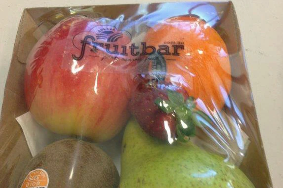
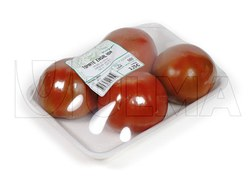
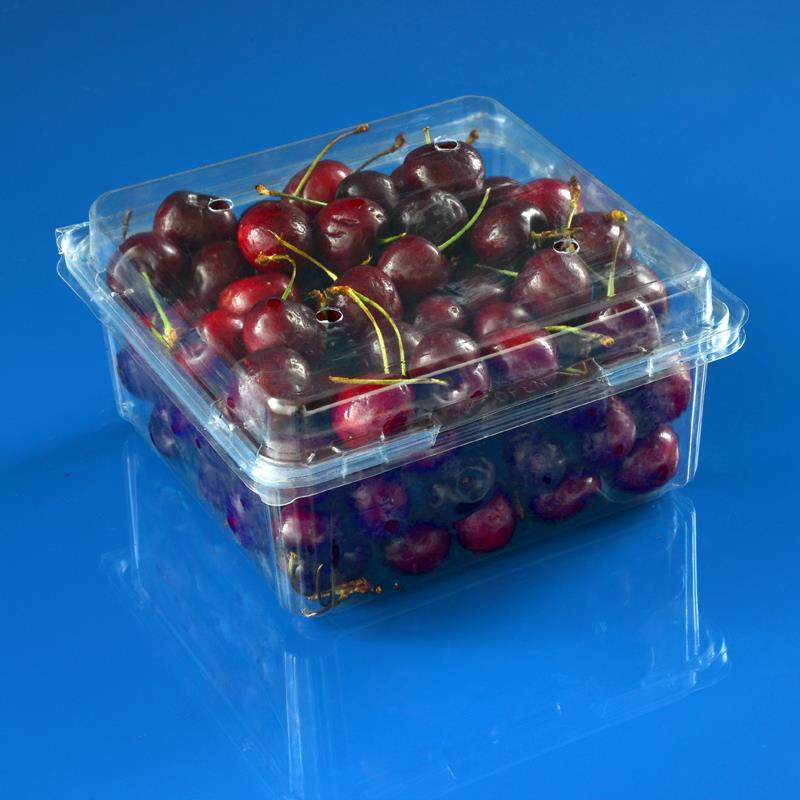
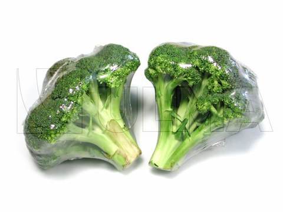
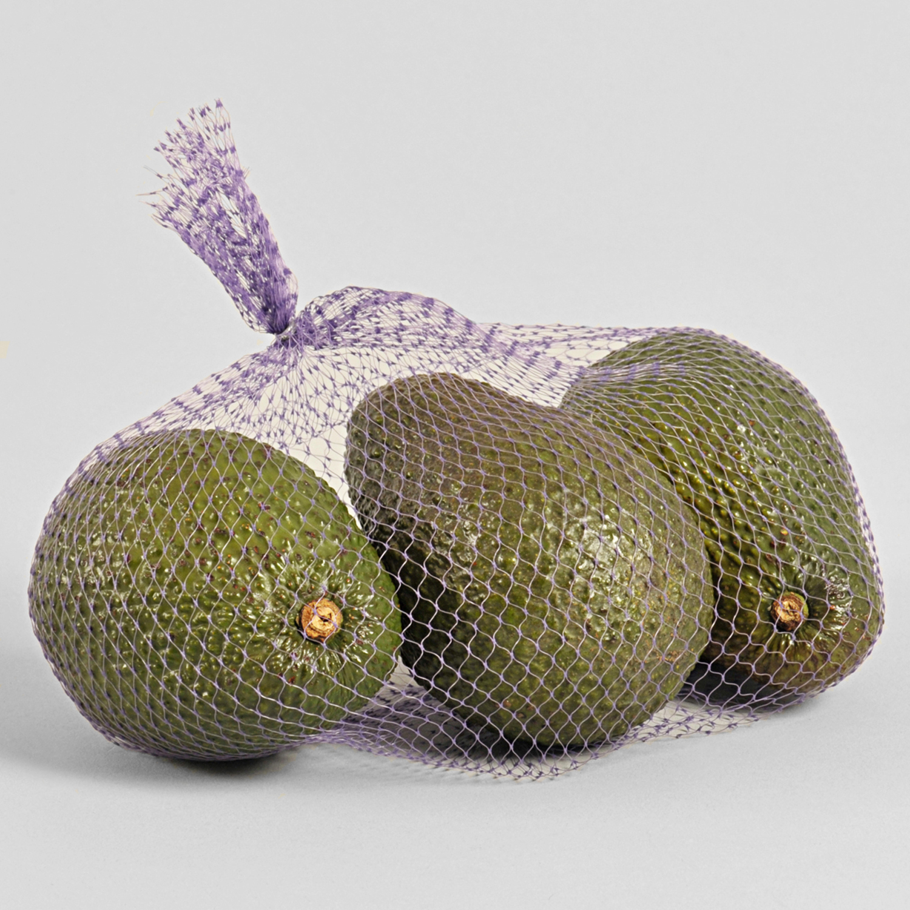
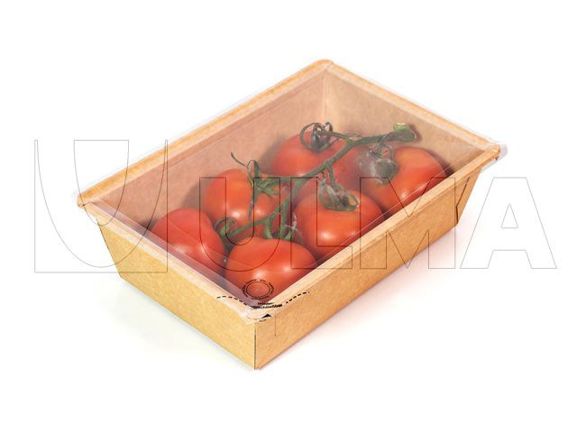

= Packaging Comparison Report
Pranab Lawrence Ekka Dasgupta, 20210525

== Case: FruitBar, Mackay family

The FruitBar is a fruit vending machine run by a farmer family in Australia.
They use a similar vending machine to us,
as opposed to elevator based machines (see Vendlife).
The major takeaway is their use of cardboard,
especially using a tray-like format with plastic on top.
This uses a sturdy base for the product,
while also giving visibility.
We can emulate this with a vacuum sealed
corn starch bag on top of a cardboard tray.

https://www.abc.net.au/news/2014-08-09/family-behind-fruit-vending-machines-inundated-with-requests/5659320

== Case: Wittern/Del Monte

Del Monte commissioned a fruit and vegetable vending machine from Wittern,
a major vending machine manufacturer.
To reduce damage from falling,
they introduced padding to the collection tray,
made the side walls angled,
and introduced a food elevator (see Vendlife).
There weren't many images available for the same.

The original article was published on Wall Street Journal,
while a full summary is available on QSR Web,
since the Wall Street Journal article has limited access.

https://www.qsrweb.com/blogs/fresh-fruit-vending-systems-food-innovation/

https://www.wsj.com/articles/SB10001424052702303550904575562480804057778

== Case: Vendlife

Several vending machines for delicate items like food and medicine
use a vending machine with an 'elevator',
which rises up to the shelf of the product,
then carries it to the collection tray.
See the linked video.
While images were not available,
this is most likely the solution used by Del Monte/Wittern.

Such machines can be easily identified by their
collection tray being on the side of the displayed products,
instead of at the bottom of the displayed products.

video::xKfW3zkb4sU[youtube,width=400,height=250]

https://www.youtube.com/watch?v=xKfW3zkb4sU

== Pre-Packaged Fruits/Vegetables

Pre-packaged fruits and vegetables use several solutions.
The most popular are shallow trays with a plastic film,
plastic boxes,
plain shrink wrapped produce,
mesh nets,
and deep trays (product only visible from top) with a hard plastic top.
However, most of these solutions don't need to deal with falling.

     

https://www.ulmapackaging.com/en/packaging-solutions/produce

https://www.google.com/search?q=fruits+and+vegetables+packaging&sxsrf=ALeKk02Ahq9mY6EnyV-Bvaa-8Xck1UPCbw:1621939629734&source=lnms&tbm=isch&sa=X&ved=2ahUKEwinm-j70-TwAhVh4zgGHeQ_B4EQ_AUoAXoECAEQAw&biw=1914&bih=1013

== Conclusion

Our requirements are that it must work with
non-elevator vending machine designs,
the packaging needs to protect the produce from falling,
the customer needs to be able to see the produce,
and we need adequate space for branding.

For this I would suggest shallow cardboard trays with
vacuum sealed corn starch bags on top.
This will give a sturdy base,
while also allowing customers to view the products from many angles.
We can apply branding to the corn starch bags,
